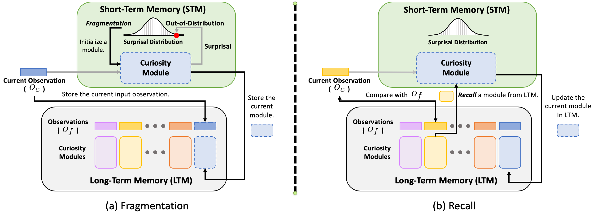

# Neuro-Inspired Fragmentation and Recall to Overcome Catastrophic Forgetting in Curiosity

Official implementation for **[Neuro-Inspired Fragmentation and Recall to Overcome Catastrophic Forgetting in Curiosity](http://arxiv.org/abs/2310.17537)** (NeurIPS 2023 Workshop).


<p align="center">
  
</p>

## Usage
Install packages.

```
pip install -r requirements.txt
```

Run Experiments.

```
python launch.py -alg ppo -curiosity_alg rnd -env jamesbond -lstm -sample_mode gpu -num_gpus 1 -normalize_advantage -normalize_reward -dual_value -normalize_obs -fragmentation -recall -use_feature -use_wandb
```


## Citation
```
@inproceedings{hwang2023neuro,
    author = {Hwang, Jaedong and Hong, Zhang-Wei and Chen, Eric and Boopathy, Akhilan and Agrawal, Pulkit and Fiete, Ila},
    title = {Neuro-Inspired Fragmentation and Recall to Overcome Catastrophic Forgetting in Curiosity},
    booktitle={NeurIPSW 2023 (Intrinsically Motivated Open-ended Learning)},
    year = {2023},
}   
```

## Acknowledgements
Our code is based on [EIPO](https://github.com/Improbable-AI/eipo) and [rlpyt](https://github.com/astooke/rlpyt)
